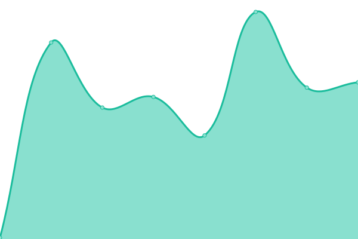

# kemdict/uptime

This repository contains the open-source uptime monitor and status page for [kemdict](https://status.kemdict.com), powered by [Upptime](https://github.com/upptime/upptime).

With [Upptime](https://upptime.js.org), you can get your own unlimited and free uptime monitor and status page, powered entirely by a GitHub repository. We use [Issues](https://github.com/kemdict/uptime/issues) as incident reports, [Actions](https://github.com/kemdict/uptime/actions) as uptime monitors, and [Pages](https://status.kemdict.com) for the status page.

<!--start: status pages-->
<!-- This summary is generated by Upptime (https://github.com/upptime/upptime) -->
<!-- Do not edit this manually, your changes will be overwritten -->
<!-- prettier-ignore -->
| URL | Status | History | Response Time | Uptime |
| --- | ------ | ------- | ------------- | ------ |
|  [Kemdict](https://kemdict.com) | Down | [kemdict.yml](https://github.com/kemdict/uptime/commits/HEAD/history/kemdict.yml) | 

 164ms
     
 | 

<a href="https://status.kemdict.com/history/kemdict">0.00%</a>
    

|  [POJ ↔ TL conversion service](https://pojtl.kemdict.com) | Down | [poj-tl-conversion-service.yml](https://github.com/kemdict/uptime/commits/HEAD/history/poj-tl-conversion-service.yml) | 

 3845ms
     
 | 

<a href="https://status.kemdict.com/history/poj-tl-conversion-service">0.00%</a>
    

<!--end: status pages-->

## License

- Code: [MIT](./LICENSE) © [kemdict](https://status.kemdict.com)
- Data in the `./history` directory: [Open Database License](https://opendatacommons.org/licenses/odbl/1-0/)
